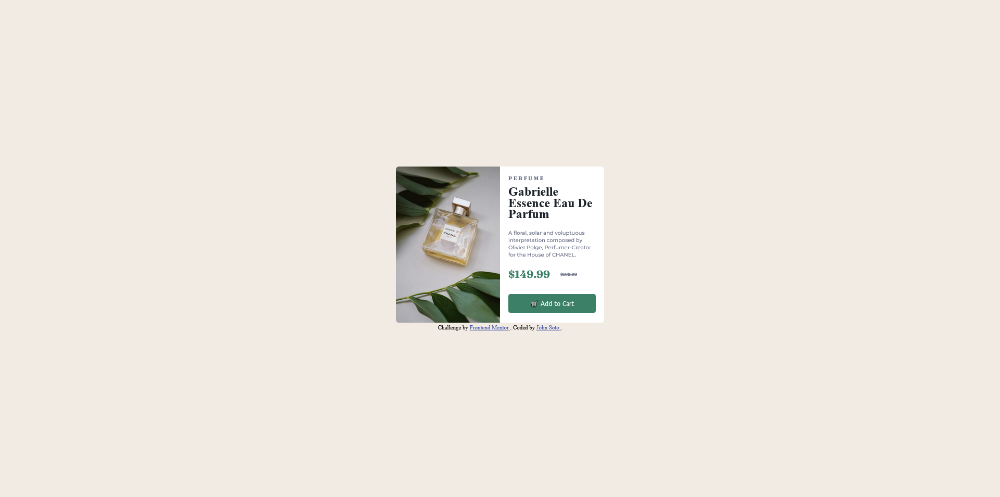

# Frontend Mentor - Product preview card component solution

This is a solution to the [Product preview card component challenge on Frontend Mentor](https://www.frontendmentor.io/challenges/product-preview-card-component-GO7UmttRfa). Frontend Mentor challenges help you improve your coding skills by building realistic projects. 

## Table of contents

- [Overview](#overview)
  - [The challenge](#the-challenge)
  - [Screenshot](#screenshot)
  - [Links](#links)
- [My process](#my-process)
  - [Built with](#built-with)
  - [What I learned](#what-i-learned)
  - [Continued development](#continued-development)
- [Author](#author)

## Overview

### The challenge

Users should be able to:

- View the optimal layout depending on their device's screen size
- See hover and focus states for interactive elements

### Screenshot

### Links

- Solution URL: [Add solution URL here](https://github.com/Soto-J/product-preview-card-component)
- Live Site URL: [Add live site URL here](https://soto-j.github.io/product-preview-card-component/)

## My process

### Built with

- Semantic HTML5 markup
- Flexbox

### What I learned

I attempted to implement what I learned from my last challenge 
QR-code component:

[Solution](https://github.com/Soto-J/qr-code-card),
[Live Url](https://soto-j.github.io/qr-code-card/),

by adding meaningful landmarks like <main>, <aside>, and <footer>.
I was having difficulties maintaining the content in the flexbox until I
I added flex-shrink: 0;
I also wasn't sure if i should adjust the image size directly or have it resized automatically in the flexbox.

### Continued development

I will continue to focus on naming conventions, lankmark implemenation, and comments. I will also focus on making sure it's responsive accross all devices.

## Author

- Website - [John Soto](https://github.com/Soto-J)
- Frontend Mentor - [@Soto-J](https://www.frontendmentor.io/profile/Soto-J)