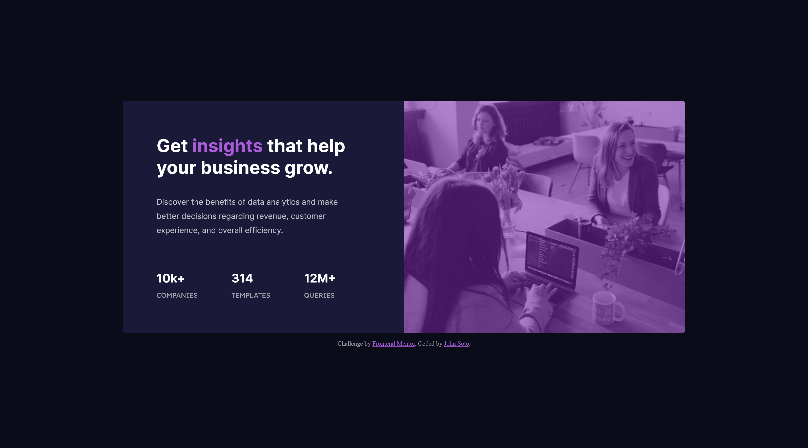

# Frontend Mentor - Stats preview card component solution

This is a solution to the [Stats preview card component challenge on Frontend Mentor](https://www.frontendmentor.io/challenges/stats-preview-card-component-8JqbgoU62). Frontend Mentor challenges help you improve your coding skills by building realistic projects.

## Table of contents

-   [Overview](#overview)
    -   [The challenge](#the-challenge)
    -   [Screenshot](#screenshot)
    -   [Links](#links)
-   [My process](#my-process)
    -   [Built with](#built-with)
    -   [What I learned](#what-i-learned)
    -   [Continued development](#continued-development)
-   [Author](#author)

## Overview

### The challenge

Users should be able to:

-   View the optimal layout depending on their device's screen size

### Screenshot

### Links

-   Solution URL: [URL](https://github.com/Soto-J/front-end-mentor-challenges/tree/master/stats-preview-card-component)
-   Live Site URL: [URL](https://soto-j.github.io/front-end-mentor-challenges/stats-preview-card-component/)

## My process

### Built with

-   Semantic HTML5 markup
-   CSS custom properties
-   Flexbox
-   CSS Grid

### What I learned

-   Had difficulties keeping the content and the image size the same in flexbox.
-   Centering the card using flex box wasnt working the way
    i thought so i centered it by using position absolute
-   Had an issue with setting background image color.

### Continued development

-   I plan on returning to this challenge when i have a better
    understanding of how images behave in flexbox.

-   Remaster challenge
    -   Had difficulties resizing image.

## Author

-   Website - [John Soto](https://github.com/Soto-J)
-   Frontend Mentor - [@Soto-J](https://www.frontendmentor.io/profile/Soto-J)
